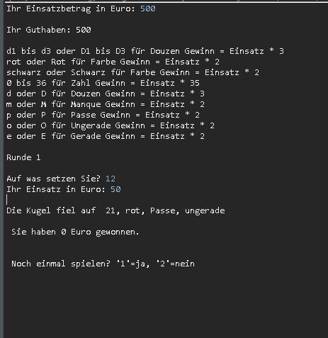

# Console Roulette
> Play roulette on the console with your bet until you're a millionaire or just glad you didn't lose any real money.


Enter your bet amount. In the following menu you will see the winning possibilities. Bet a certain amount on your selection.





## Execute

Windows or Linux:

```java
javac Spiel.java
java Spiel.class
```


## Technologies

Created with

- [ ] Eclipse Version: 2018-12 (4.10.0)
  Build id: 20181214-0600
- [ ] Typora

Programming language:

- [ ] Java

Application style:

- [ ] Console


## Release History

* 1.1

    * UPDATE: Implemented other cases of winning or losing 

* 1.0
  
    * Work in progress
    
      

## Meta

Marcus Greiner –  marcusgreiner@ITsmus.de

[https://github.com/velotist/Roulette](https://github.com/velotist/DiceGame)

